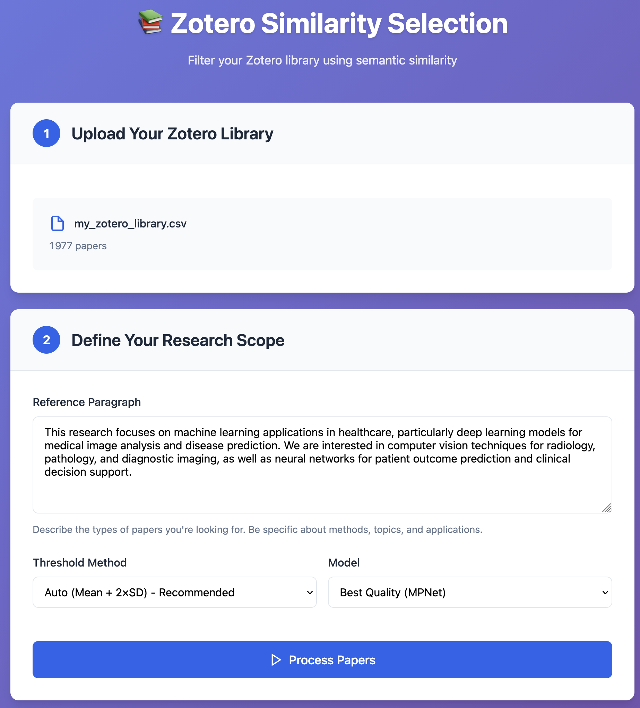
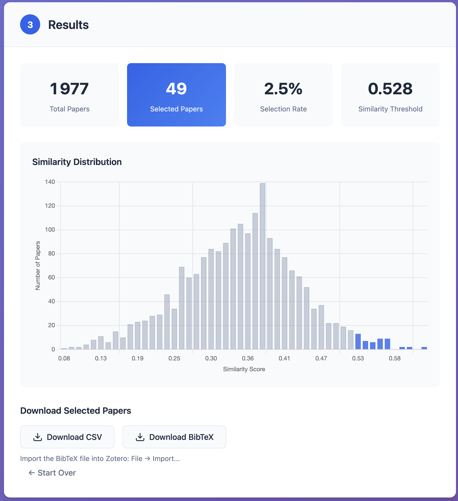

## ZSS: Zotero Similarity Selection

    <form action="https://drive.google.com/file/d/19kZ_4UT4ei-NLnZlEwnvWbfP2nGsgAXz/view?usp=drive_link" method="get" target="_blank">
        <button type="submit">View on GitHub</button>
    </form>

ZSS is a research support tool that helps scholars efficiently filter relevant papers from large Zotero libraries by computing semantic similarity using state-of-the-art sentence embeddings. Given a CSV export of a Zotero library, the tool compares paper titles and abstracts against a user-defined description of the research scope and automatically selects the most relevant entries.

<figure style="text-align: center;">
    
    <figcaption>
        <strong>Figure 1.</strong> ZSS interface for uploading a Zotero CSV export and defining the research scope description used for semantic similarity comparison.
    </figcaption>
</figure>

The filtered results can be exported as a CSV file and converted to BibTeX for re-importing into Zotero. The results page provides insights about the selection process, including a similarity distribution histogram to visualize how papers are distributed across similarity scores and where the threshold is.

<figure style="text-align: center;">
    
    <figcaption>
        <strong>Figure 2.</strong> Results dashboard showing corpus statistics, similarity threshold, and the distribution of similarity scores.
    </figcaption>
</figure>
