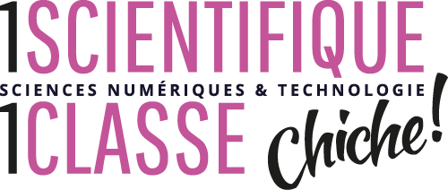

## Outreach talks

- Intervention [CHICHE](https://chiche-snt.fr/) "1 scientifique, 1 classe" auprès des 2nde spécialité Sciences Numérique et Technologie. 03 Avril 2025. Lycée Jean-Victor Poncelet, Saint-Avold (Moselle), France. 

- Intervention [CHICHE](https://chiche-snt.fr/) "1 scientifique, 1 classe" auprès des 2nde spécialité Sciences Numérique et Technologie. 11 Avril 2024. Lycée Jean Lurçat, Bruyères (Vosges), France. 

- 

    

        
<i>ChatGPT : du fonctionnement aux usages.</i> Talk as part of the discussion "Intérêts et dangers des OpenAI, comment progresser à l'université avec ChatGPT ?" hosted by S. Ferey, Faculté de Droit, Sciences Économiques et Gestion de Nancy, 21 September 2023. Nancy, France.

        

            <form action="https://drive.google.com/file/d/19kZ_4UT4ei-NLnZlEwnvWbfP2nGsgAXz/view?usp=drive_link" method="get" target="_blank">
                <button type="submit">Slides (in French)</button>
            </form>
        

    

    

  

## Seminar talks

- 

  

    

      <i>Conversational Control of LLMs Driven by Ontological Definitions: Ontology Design and Fine-Tuning Approaches</i>
    

    <ul>
      <li>
        Talk for
        <a href="https://site-23068d.gitlabpages.inria.fr/seminars/2025-12-08-PhD-day.html">
          MosAIk PhD Day
        </a>.
        December 8th 2025.
        Laboratoire Lorrain de Recherche en Informatique et ses Applications (LORIA),
        Nancy, France.
      </li>
      <li>
        Talk for
        <a href="...">LIPN Seminar</a>.
        February 2nd 2026.
        LIPN, Université Sorbonne Paris-Nord,
        Villetaneuse, France.
      </li>
    </ul>
  

  

    
  

- 

    

        
<i>Towards Hybrid Conversational AI: How to Combine Deep Learning and Symbolic Approaches?</i> Talk for "Cognition et Langage" Seminar of the Institut du Digital, Management et Cognition (IDMC), Nancy, France.

        

            <form action="https://github.com/B-Gendron/idmc-seminar/blob/main/presentation.pdf" method="get" target="_blank">
                <button type="submit">Slides</button>
            </form>
        

    

    

  

- 

    

        
<i>Mastering Large Language Models: Efficient Techniques for Fine-Tuning.</i> Tutorial for <a href="https://deeploria.netlify.app/">DeepLorIA</a> Network. January 15th 2025. Laboratoire Lorrain de Recherche en Informatique et ses Applications (LORIA), Nancy, France.

        

            <form action="https://github.com/B-Gendron/tutorial-deeploria" method="get" target="_blank">
                <button type="submit">Tutorial material</button>
            </form>
        

    

    

  

- 

    

        
<i>Code-Switching as a Cross-Lingual Training Signal: Example with Unsupervised Bilingual Embedding</i>. Paper presentation at SyNaLP seminar. October 24th 2024. LORIA, Nancy, France.

        

            <form action="https://github.com/B-Gendron/coswitchmap/tree/main" method="get" target="_blank">
                <button type="submit">Slides</button>
            </form>
            <form action="https://b-gendron.github.io/publications/publications-2/" method="get" target="_blank">
                <button type="submit">Paper</button>
            </form>
        

    

    

  

## Conference talks

- 

    

        
<i>Towards Ontology-Based Descriptions of Conversations with Qualitatively-Defined Concepts</i>. Oral presentation at <a href="https://toth.condillac.org/">TOTh 2025</a> hosted by Université Savoie Mont Blanc, Chambéry, France. June 6th 2025.

        

            <form action="https://B-Gendron.github.io/files/Gendron_TOTh_noAppendix.pdf" method="get" target="_blank">
                <button type="submit">Slides</button>
            </form>
        

    

    

  

- 

    

        
<i>SentEmoContext: Context-Aware Metric Learning for Efficient Emotion Recognition in Conversation</i>. Remote poster presentation for <a href="https://workshop-wassa.github.io/">WASSA@ACL2024</a> hosted in Bangkok, Thailand. August 15th 2024.

        

            <form action="https://github.com/B-Gendron/wassa-poster/tree/main" method="get" target="_blank">
                <button type="submit">Poster</button>
            </form>
            <form action="https://underline.io/lecture/104199-sec-context-aware-metric-learning-for-efficient-emotion-recognition-in-conversation" method="get" target="_blank">
                <button type="submit">Recorded oral presentation</button>
            </form>
        

    

    

  

- 

    

        
<i>SEC : contexte émotionnel phrastique intégré pour la reconnaissance émotionnelle efficiente dans la conversation</i>. Oral presentation at <a href="https://jep-taln2024.sciencesconf.org/resource/page/id/4">JEP-TALN 2024</a>. July 9th 2024, Toulouse, France.

        

            <form action="https://github.com/B-Gendron/taln-sec" method="get" target="_blank">
                <button type="submit">Slides (in French)</button>
            </form>
        

    

    

  

- 

    

        
<i>Controlled Conversational Models through Conversation-Dedicated Ontology</i>. Poster presentation at <a href="https://2024.semanticwebschool.org/">ISWS 2024</a> Research Summer School. June 10th 2024, Bertinoro, Italy.

        

            <form action="https://github.com/B-Gendron/isws-poster" method="get" target="_blank">
                <button type="submit">Poster</button>
            </form>
        

    

    

  

